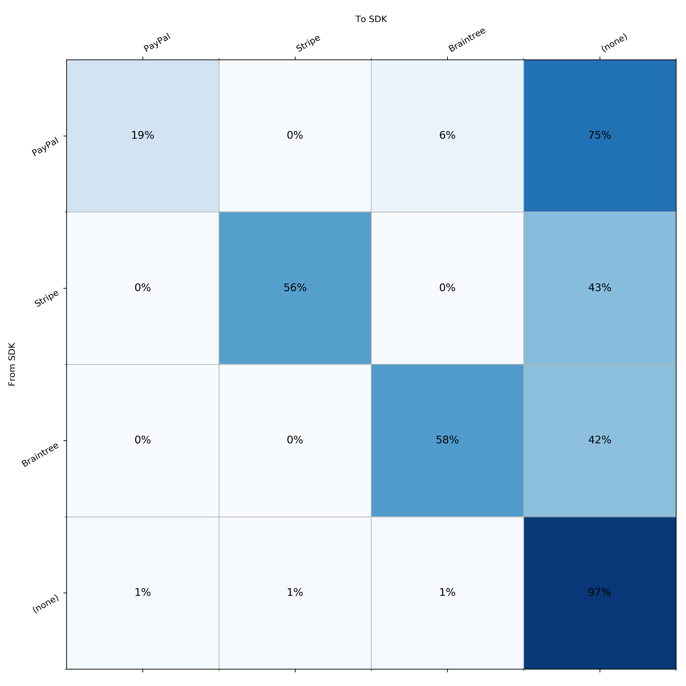

# Overview

The goal of this project is to build a web app to render competitive matrices in a browser:

This matrix was generated from a sample of apps that use Stripe, PayPal, or Braintree for payments, or none of the above.

Examples of facts we can read from this matrix:
* Stripe has 10,572 apps currently using their SDK (of the sampled apps)
* PayPal has 11,892 apps currently using their SDK
* Stripe churned 22 customers to PayPal
* Stripe churned 8,082 customers to another solution not covered in this matrix
* PayPal acquired 11,844 app integrations from another solution not covered in this matrix
* 879,587 apps from the sample haven't integrated any of these three payments SDKs

This matrix was generated using matplotlib. We'd like to add a similar matrix into our web-based product, but matplotlib isn't a good solution because the images it generates aren't interactive. We'd prefer a solution that was rendered client-side.

# Objectives

This repository contains a SQLite file with some sample data. Please build an API in Python that serves requests against this data.

The client should render a competitive matrix similar in spirit to the example above.

Feel free to complete as much or as little of the project as you'd like. Spare your time from implementing features that would be time consuming or uninteresting, and focus instead on parts that would make for better discussion when reviewing together. Make notes of ideas, bugs, and deficiencies to discuss together.

Some ideas you can consider for extra credit:
* Shade the cells according to magnitude.
* Allow the user to select a set of SDKs to include in the matrix, and re-render as they change their selection.
* Allow the user to view example apps for a cell of the matrix they select.
* Compute a normalized matrix (by row) to better visualize retention and attrition rates. Ex: 
* We use [Nix](https://nixos.org/nix/) for package management. If you add your dependencies to `default.nix`, then it's easy for us to run your code. Install nix and launch the environment with `nix-shell` (works on Linux, macOS, and most unixes). Or install dependencies however you're comfortable and give us instructions.

There's no time limit. Spend as much or as little time on it as you'd like. Clone this git repository (don't fork), and push to a new repository when you're ready to share. We'll schedule a follow-up call to review.
